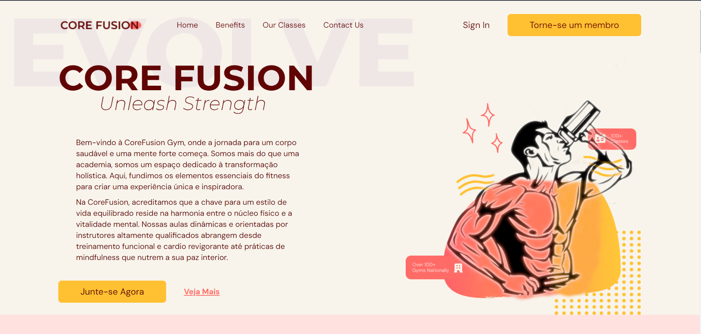

## *CoreFusionGym*: A Fitness Front-end Web Application | Uma aplicação web front-end fitness para academias



#### Acesso em: **https://corefusiongym-fitness-react-webapp.pages.dev**

### Descrição:
CoreFusionGym, uma aplicação web front-end construída com as tecnologias React, Typescript e Vite. Esta aplicação é projetada especialmente para academias e centros de fitness, oferecendo uma experiência completa para seus membros.
<hr/>

### Rodar:

Instale os pacotes:

```npm install```

Rode a aplicação:

```npm run dev```

<hr/>

### Principais componentes:

* Barra de Navegação
* Home Page
* Benefícios
* Classes ofertadas
* Sessão de contato
* Rodapé

<hr/>

### Frameworks para CSS:

* Tailwind

<hr/>

### Características:

*  Design responsivo
*  UI/UX
*  Paleta de Cores Harmoniosa
*  Tipografia Legível
*  Foco na Usabilidade Móvel
*  Transição suave
*  Consistência de Design

### Deploy:

* Cloudfare pages: **https://pages.cloudflare.com**

### Preview:

https://github.com/GuiFernandess7/CoreFusionGym-Fitness-React-WebApp/assets/63022500/66ac7038-65f9-4d88-968c-82e64686c738

<hr/>

### Description:
CoreFusionGym, a front-end web application built using React, Typescript, and Vite technologies. This application is specially designed for gyms and fitness centers, offering a comprehensive experience for its members.

<hr/>

### To Run:

Install the packages:

```npm install```

Run the application:

```npm run dev```

### Key Components:

* Navigation Bar
* Home Page
* Benefits
* Offered Classes
* Contact Section
* Footer
* CSS Framework:
* Tailwind

### Features:
* Responsive Design
* UI/UX
* Harmonious Color Palette
* Readable Typography
* Focus on Mobile Usability
* Smooth Transitions
* Design Consistency
UI/UX
Harmonious Color Palette
Readable Typography
Focus on Mobile Usability
Smooth Transitions
Design Consistency

